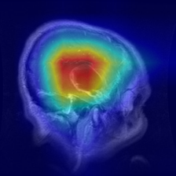

# 🧠 MediScan — Medical Image Classification

> An end-to-end deep learning project for automated brain MRI image classification using **EfficientNet-B0**, **PyTorch**, **Grad-CAM**, **Weights & Biases**, and **Streamlit**.

[](https://www.python.org/)
[](https://pytorch.org/)
[](https://streamlit.io/)
[](https://wandb.ai/)
[](LICENSE)

---

## 🌐 Live Application

🚀 **Try MediScan Online:**

👉 https://mediscanmedicalimageclassification-ywdozzsxzf5nngqvvb48ve.streamlit.app/

The application is publicly accessible and can be opened directly in a browser without requiring a login.

---

## 📌 Project Overview

**MediScan** is a deep learning-based medical image classification project designed to classify brain MRI images into four categories:

- 🧠 Glioma
- 🧠 Meningioma
- ✅ No Tumor
- 🧠 Pituitary

The project follows a complete machine learning workflow starting from dataset preparation and exploratory data analysis to model training, evaluation, explainability, experiment tracking, error analysis, and cloud deployment.

The final system uses **EfficientNet-B0 pretrained on ImageNet** as the primary classification model.

---

## 🎯 Objectives

The main objectives of MediScan are:

1. Build a reliable brain MRI image classification pipeline.
2. Train a deep learning model using transfer learning.
3. Compare EfficientNet-B0 with ResNet50.
4. Evaluate the model using multiple classification metrics.
5. Generate Grad-CAM visualizations for model explainability.
6. Track experiments using Weights & Biases.
7. Analyze model errors and class-wise prediction behavior.
8. Deploy the final model as a publicly accessible Streamlit application.
9. Provide a model card and technical documentation.

---

## 🗂️ Dataset

The project uses the **Brain Tumor MRI Dataset** from Kaggle.

### Dataset Source

https://www.kaggle.com/datasets/masoudnickparvar/brain-tumor-mri-dataset

### Original Dataset

| Split | Images |
|---|---:|
| Training | 5,600 |
| Testing | 1,600 |
| **Total** | **7,200** |

The original dataset contains four balanced classes:

| Class | Training | Testing |
|---|---:|---:|
| Glioma | 1,400 | 400 |
| Meningioma | 1,400 | 400 |
| No Tumor | 1,400 | 400 |
| Pituitary | 1,400 | 400 |

---

## 🔀 Final Dataset Split

For this project, the dataset was reorganized using a **stratified 70/15/15 split**.

| Split | Images |
|---|---:|
| Training | 5,040 |
| Validation | 1,080 |
| Testing | 1,080 |
| **Total** | **7,200** |

Each split maintains approximately the same class distribution.

The final test set contains:

- 270 Glioma images
- 270 Meningioma images
- 270 No Tumor images
- 270 Pituitary images

---

## 🧬 Class Mapping

```python
class_to_idx = {
    "glioma": 0,
    "meningioma": 1,
    "notumor": 2,
    "pituitary": 3
}
```

---

# 🛠️ Tech Stack

### Programming Language

- Python

### Deep Learning

- PyTorch
- Torchvision
- EfficientNet-B0
- ResNet50

### Data Processing

- NumPy
- Pandas
- Pillow

### Visualization

- Matplotlib
- Seaborn
- OpenCV

### Machine Learning Utilities

- Scikit-learn

### Explainable AI

- Grad-CAM

### Experiment Tracking

- Weights & Biases

### Deployment

- Streamlit
- Hugging Face Hub

### Development Environment

- Google Colab
- NVIDIA GPU

---

# 🏗️ Project Architecture

```text
Brain MRI Image
       │
       ▼
Image Preprocessing
       │
       ├── Resize → 224 × 224
       ├── RGB Conversion
       └── Normalization
       │
       ▼
EfficientNet-B0
       │
       ▼
Classification Head
       │
       ▼
4-Class Prediction
       │
       ├── Glioma
       ├── Meningioma
       ├── No Tumor
       └── Pituitary
       │
       ▼
Confidence Score
       │
       ▼
Grad-CAM Explanation
```

---

# 🧪 Data Preparation

The preprocessing pipeline includes:

- Image loading
- Image resizing to **224 × 224**
- Grayscale-to-RGB conversion where required
- Tensor conversion
- Pixel normalization
- Training-time augmentation
- Validation preprocessing
- Testing preprocessing
- Stratified dataset splitting
- Data leakage verification

### Final Batch Verification

```text
Images shape : torch.Size([32, 3, 224, 224])
Labels shape : torch.Size([32])

Images dtype : torch.float32
Labels dtype : torch.int64

Pixel range:
Min: 0.0
Max: 1.0
```

---

# 🧠 Model Development

## EfficientNet-B0

The primary model is **EfficientNet-B0 pretrained on ImageNet**.

The pretrained backbone was adapted for four-class brain MRI classification.

### Final Configuration

| Parameter | Value |
|---|---|
| Model | EfficientNet-B0 |
| Pretrained | ImageNet |
| Input Size | 224 × 224 |
| Number of Classes | 4 |
| Optimizer | Adam |
| Learning Rate | 0.002 |
| Batch Size | 32 |
| Dropout | 0.1 |
| Loss Function | Cross Entropy Loss |
| Scheduler | StepLR |
| Augmentation | Weak augmentation |

---

# 📊 Final Model Performance

## EfficientNet-B0

The final EfficientNet-B0 model achieved:

| Metric | Result |
|---|---:|
| Best Validation Accuracy | **90.09%** |
| Test Accuracy | **91.20%** |
| Weighted F1 Score | **91.16%** |

### Test Accuracy

**91.20%**

This means the final model correctly classified approximately 91 out of every 100 images in the held-out test set.

---

# 📈 ROC-AUC Performance

The one-vs-rest ROC-AUC scores for EfficientNet-B0 were:

| Class | ROC-AUC |
|---|---:|
| Glioma | **0.9776** |
| Meningioma | **0.9669** |
| No Tumor | **0.9970** |
| Pituitary | **0.9921** |

The model achieved strong class separability across all four categories.

---

# 🔬 Model Comparison

A second architecture, **ResNet50**, was trained to compare performance with EfficientNet-B0.

| Model | Best Validation Accuracy | Test Accuracy | Weighted F1 |
|---|---:|---:|---:|
| EfficientNet-B0 | **90.09%** | **91.20%** | **91.16%** |
| ResNet50 | 90.00% | 90.93% | 90.83% |

### 🏆 Final Model

**EfficientNet-B0** was selected as the final model because it achieved slightly better validation accuracy, test accuracy, and weighted F1 score.

---

# 🔥 Grad-CAM Explainability

MediScan uses **Grad-CAM (Gradient-weighted Class Activation Mapping)** to visualize the image regions that contribute most to the model's prediction.

This provides a visual explanation of the model's decision-making process.

### Grad-CAM Verification

A total of **12 test samples** were analyzed:

- 3 Glioma
- 3 Meningioma
- 3 No Tumor
- 3 Pituitary

Results:

| Metric | Result |
|---|---:|
| Correct Predictions | 11 / 12 |
| Sample Accuracy | **91.67%** |
| Average Confidence | **89.52%** |

The Grad-CAM visualizations help inspect whether the model is focusing on meaningful regions of the MRI image.

---

## 🖼️ Grad-CAM Example



---

# 📉 Error Analysis

The final model was evaluated on the complete **1,080-image test set**.

### Overall Errors

```text
Correct predictions : 985
Misclassified       : 95
Error rate          : 8.80%
```

### Class-wise Error Rate

| Class | Error Rate |
|---|---:|
| Glioma | **15.93%** |
| Meningioma | **12.96%** |
| No Tumor | **1.48%** |
| Pituitary | **4.81%** |

### Major Failure Pattern

The dominant confusion was:

```text
Glioma → Meningioma : 33 cases
```

This indicates that distinguishing between some tumor types remains the primary challenge for the model.

---

# 📊 Prediction Distribution Analysis

The test dataset is balanced with 270 images per class.

The model's prediction distribution was:

| Class | Actual | Predicted |
|---|---:|---:|
| Glioma | 270 | 240 |
| Meningioma | 270 | 279 |
| No Tumor | 270 | 286 |
| Pituitary | 270 | 275 |

The results indicate a small **class-wise prediction-distribution bias**, particularly toward Meningioma and No Tumor predictions.

This should not be interpreted as demographic bias because the dataset does not provide demographic information necessary for such an analysis.

---

# 🔍 Hyperparameter Tuning

The project evaluated different training configurations involving:

- Learning rate
- Batch size
- Augmentation strength
- Dropout

The final configuration was selected based on validation performance and training stability.

### Final Configuration

```text
Learning Rate : 0.002
Batch Size    : 32
Dropout       : 0.1
Augmentation  : Weak
Optimizer     : Adam
Scheduler     : StepLR
```

---

# 📡 Experiment Tracking

Experiments were tracked using **Weights & Biases (W&B)**.

### W&B Project

https://wandb.ai/sagarsharma131006-panipat-institute-of-engineering-and-t/MediScan-Medical-Image-Classification

### Run

```text
Run Name : day13-experiment-tracking
Run ID   : xzkmsk5u
```

The tracked experiment includes model training and evaluation information.

### Artifact

```text
mediscan-efficientnet-b0-results
```

---

# 🚀 Streamlit Application

The final MediScan model was deployed using **Streamlit Community Cloud**.

## 🌐 Public Application

https://mediscanmedicalimageclassification-ywdozzsxzf5nngqvvb48ve.streamlit.app/

The application can be accessed publicly through a web browser.

---

# 💻 Application Features

The MediScan web application provides:

### 1. 📤 MRI Image Upload

Users can upload a brain MRI image directly through the web interface.

### 2. 🧠 Tumor Classification

The trained EfficientNet-B0 model predicts one of four classes:

```text
Glioma
Meningioma
No Tumor
Pituitary
```

### 3. 📊 Prediction Confidence

The application displays the predicted class along with the model confidence score.

### 4. 📈 Class Probabilities

The probability distribution across all four classes is displayed.

### 5. 🔥 Grad-CAM

The application generates a Grad-CAM visualization to provide an explanation of the prediction.

### 6. ⚠️ Medical Disclaimer

The application clearly states that it is an educational/research demonstration and is **not a medical diagnostic tool**.

---

# ☁️ Cloud Model Hosting

The deployed application downloads the trained EfficientNet-B0 model from Hugging Face Hub instead of storing large model weights directly inside the GitHub repository.

### Hugging Face Model Repository

```text
SagarsS9812/mediscan-efficientnet-b0
```

This approach keeps the GitHub repository lightweight while allowing the deployed application to load the model when required.

---

# 📁 Project Structure

```text
MediScan_Medical_Image_Classification/
│
├── app/
│   └── app.py
│
├── data/
│   └── raw/
│
├── figures/
│   └── day15_cloud_inference_gradcam_test.png
│
├── models/
│
├── notebooks/
│   ├── MediScan_Day1_Setup.ipynb
│   ├── MediScan_Day2_EDA_Data_Preparation.ipynb
│   ├── MediScan_Day3_DataLoader_Verification.ipynb
│   ├── MediScan_Day4_Model_Setup.ipynb
│   ├── MediScan_Day5_Training.ipynb
│   ├── MediScan_Day6_GradCAM_Verification.ipynb
│   ├── MediScan_Day7_Model_Training.ipynb
│   ├── MediScan_Day8_Hyperparameter_Tuning.ipynb
│   ├── MediScan_Day9_Model_Evaluation.ipynb
│   ├── MediScan_Day10_GradCAM.ipynb
│   ├── MediScan_Day11_Model_Comparison.ipynb
│   ├── MediScan_Day12_Streamlit_App.ipynb
│   ├── MediScan_Day13_WandB_Tracking.ipynb
│   ├── MediScan_Day14_Error_Analysis.ipynb
│   └── MediScan_Day15_Deployment_Final_Demo.ipynb
│
├── reports/
│   ├── MediScan_Model_Card.md
│   └── MediScan_Final_Presentation_Content.md
│
├── requirements.txt
├── README.md
└── .gitignore
```

> Dataset files, trained model weights, generated prediction arrays, and other large artifacts are excluded from GitHub using `.gitignore`.

---

# 🗓️ 15-Day Development Roadmap

## Day 1 — Project Setup

- Created GitHub repository
- Set up Google Colab
- Enabled GPU
- Installed required libraries
- Mounted Google Drive
- Verified dataset and classes

---

## Day 2 — EDA & Data Preparation

- Explored dataset
- Analyzed class distribution
- Visualized MRI samples
- Analyzed image dimensions
- Created stratified 70/15/15 split
- Verified no data leakage
- Created PyTorch Dataset
- Created DataLoaders

---

## Day 3 — DataLoader Verification

Verified:

- Batch size
- Image shape
- Label shape
- Data types
- Pixel range
- Class mapping

Final batch:

```text
[32, 3, 224, 224]
```

---

## Day 4 — Model Setup

- Loaded pretrained EfficientNet-B0
- Modified classification head
- Configured four output classes
- Verified forward pass

---

## Day 5 — Initial Training

- Implemented training loop
- Implemented validation loop
- Added loss calculation
- Added accuracy calculation
- Saved model checkpoints

---

## Day 6 — Model Verification

- Verified model outputs
- Checked prediction pipeline
- Prepared explainability workflow

---

## Day 7 — Model Training

- Trained the model
- Monitored training loss
- Monitored validation loss
- Monitored training accuracy
- Monitored validation accuracy
- Saved the best checkpoint

---

## Day 8 — Hyperparameter Tuning

Experimented with:

- Learning rate
- Batch size
- Dropout
- Augmentation strength

Final configuration was selected based on validation performance.

---

## Day 9 — Model Evaluation

Implemented:

- Accuracy
- Precision
- Recall
- F1 score
- Classification report
- Confusion matrix
- ROC curves
- ROC-AUC

---

## Day 10 — Grad-CAM

Implemented Grad-CAM visualizations.

Verified model attention on multiple MRI samples.

Final verification:

```text
Samples      : 12
Correct      : 11
Accuracy     : 91.67%
Avg. Confidence : 89.52%
```

---

## Day 11 — Model Comparison

Compared:

- EfficientNet-B0
- ResNet50

EfficientNet-B0 achieved the best overall performance and was selected as the final model.

---

## Day 12 — Web Application

Created the Streamlit application with:

- Image upload
- Model inference
- Prediction display
- Confidence score
- Class probabilities
- Grad-CAM visualization
- Medical disclaimer

---

## Day 13 — Experiment Tracking

Integrated Weights & Biases for experiment tracking.

Tracked:

- Training metrics
- Validation metrics
- Model results
- Experiment artifacts

---

## Day 14 — Error & Failure Analysis

Analyzed:

- Misclassified images
- Class-wise error rates
- Confusion patterns
- Prediction distribution
- Model failure cases

Major confusion:

```text
Glioma → Meningioma
```

---

## Day 15 — Deployment & Final Documentation

Completed:

- Cloud-ready Streamlit application
- Hugging Face model hosting
- Public Streamlit deployment
- Cloud inference verification
- Cloud Grad-CAM verification
- Final README
- Model card
- Presentation content
- Final project documentation

---

# 📋 Final Project Results

| Component | Result |
|---|---|
| Dataset | Brain Tumor MRI Dataset |
| Total Images | 7,200 |
| Classes | 4 |
| Dataset Split | 70/15/15 |
| Input Size | 224 × 224 |
| Primary Model | EfficientNet-B0 |
| Comparison Model | ResNet50 |
| Test Accuracy | **91.20%** |
| Weighted F1 | **91.16%** |
| Best Validation Accuracy | **90.09%** |
| Best ROC-AUC | **0.9970** |
| Grad-CAM Verification | **91.67%** |
| Misclassification Rate | **8.80%** |
| Deployment | Streamlit Community Cloud |
| Model Hosting | Hugging Face Hub |
| Experiment Tracking | W&B |

---

# 🧪 Example Prediction

The deployed application produces output similar to:

```text
Predicted Class : Meningioma
Confidence      : 65.65%

Class Probabilities:
Glioma      : 28.85%
Meningioma  : 65.65%
No Tumor    : 0.79%
Pituitary   : 4.70%
```

The application also generates a Grad-CAM visualization for the uploaded image.

---

# 📚 Documentation

## Model Card

The project includes a detailed model card covering:

- Model architecture
- Intended use
- Dataset
- Training procedure
- Evaluation results
- Limitations
- Ethical considerations
- Medical disclaimer

Location:

```text
reports/MediScan_Model_Card.md
```

---

## Final Presentation

Presentation content for the final project demonstration is available at:

```text
reports/MediScan_Final_Presentation_Content.md
```

---

# 🔐 Repository & Artifact Management

Large and generated files are intentionally excluded from GitHub.

The `.gitignore` protects:

```text
*.pth
*.pt
*.ckpt
*.npy
*.zip
data/raw/
.env
*api_key*
*secret*
*token*
```

This prevents:

- Large model files from bloating the repository
- Dataset files from being committed
- Prediction arrays from being committed
- Secrets/API keys from being accidentally exposed

---

# ⚠️ Limitations

MediScan is a machine learning research and educational project.

Important limitations include:

- The model is trained on a specific public dataset.
- Performance may differ on MRI images from other sources.
- MRI scanners, image quality, acquisition protocols, and preprocessing can vary.
- Some tumor classes have visually similar characteristics.
- Glioma and Meningioma showed the highest confusion.
- The model should not be considered clinically validated.
- The reported performance should not be interpreted as medical diagnostic accuracy.

---

# ⚕️ Medical Disclaimer

**MediScan is intended strictly for educational and research demonstration purposes.**

It is **not a medical device** and should **not be used for diagnosis, treatment decisions, or clinical decision-making**.

Predictions generated by this application must not replace evaluation by qualified medical professionals.

If you have concerns about a medical condition, consult a qualified healthcare professional.

---

# 🔗 Important Links

### 🚀 Live Application

https://mediscanmedicalimageclassification-ywdozzsxzf5nngqvvb48ve.streamlit.app/

### 💻 GitHub Repository

https://github.com/SagarSharma131006/MediScan_Medical_Image_Classification

### 📊 Weights & Biases

https://wandb.ai/sagarsharma131006-panipat-institute-of-engineering-and-t/MediScan-Medical-Image-Classification

### 🤗 Hugging Face Model

https://huggingface.co/Sagarss9812/mediscan-efficientnet-b0

### 📚 Dataset

https://www.kaggle.com/datasets/masoudnickparvar/brain-tumor-mri-dataset

---

# 👨‍💻 Author

**Sagar Sharma**

B.Tech CSE — Artificial Intelligence & Machine Learning

GitHub:  
https://github.com/SagarSharma131006

---

# ⭐ Project Status

```text
╔══════════════════════════════════════════╗
║        MEDISCAN PROJECT STATUS           ║
╠══════════════════════════════════════════╣
║ Day 01  ✅ Project Setup                 ║
║ Day 02  ✅ EDA & Data Preparation        ║
║ Day 03  ✅ DataLoader Verification       ║
║ Day 04  ✅ Model Setup                   ║
║ Day 05  ✅ Initial Training              ║
║ Day 06  ✅ Model Verification            ║
║ Day 07  ✅ Model Training                ║
║ Day 08  ✅ Hyperparameter Tuning         ║
║ Day 09  ✅ Model Evaluation              ║
║ Day 10  ✅ Grad-CAM Explainability       ║
║ Day 11  ✅ Model Comparison              ║
║ Day 12  ✅ Streamlit Application         ║
║ Day 13  ✅ W&B Experiment Tracking       ║
║ Day 14  ✅ Error Analysis                ║
║ Day 15  ✅ Deployment & Final Demo       ║
╠══════════════════════════════════════════╣
║        🚀 PROJECT COMPLETED 🚀           ║
╚══════════════════════════════════════════╝
```

---

# ⭐ If You Like This Project

If you find MediScan useful or interesting, consider giving the repository a ⭐ on GitHub.

---

## 🧠 MediScan

**From MRI data → Deep Learning → Explainable AI → Web Deployment**

🚀 **Built with PyTorch | Explained with Grad-CAM | Tracked with W&B | Deployed with Streamlit**
